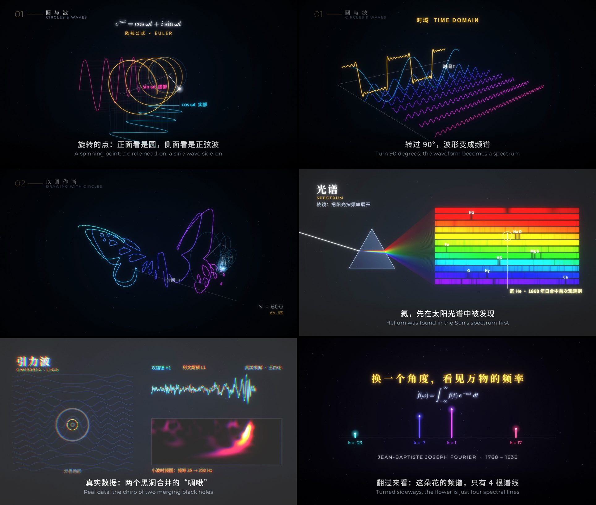

# 万物皆波 · 傅里叶变换宣传片

一部 3 分 46 秒的宣传片，1080p 为主，4K 可一条命令重渲。从一个旋转的圆讲起，讲到声音、图像、光谱、DNA、大脑、黑洞、潮汐、Wi-Fi、量子、AI，以及拉普拉斯变换、小波等更大的“变换家族”。

- 镜头 4–6 秒一切。章节之间用“圆形光圈”转场，并抛出一个问题串起全片：从一个圆说起 → 那么，任何图形呢？→ 声音呢？→ 图像呢？→ 只是声音和图像吗？→ 只有傅里叶变换吗？→ 这一切，从哪里开始？
- 数学概念尽量做成三维画面：欧拉螺旋、时域到频域的 90° 旋转、沿时间轴展开的本轮、三维频谱地形、球谐函数、s 平面、热方程曲面。三维曲面带光照和距离雾，快速运动的镜头有运动模糊。
- 用到的真实数据：LIGO 探测到的 GW150914 引力波应变（汉福德、利文斯顿两台探测器，经白化和带通）、哈勃极深场照片、猫的照片、脑部 MRI。太阳光谱按真实夫琅禾费谱线的位置绘制。



成片（1920×1080 · 30 fps · 3:46）有两个版本：

- **最高码率版**：H.264 CRF 10（约 50 Mbps）+ AAC 320k，1.42 GB。GitHub 限制单个文件不超过 100 MB，这里又用不了 Git LFS，所以拆成了 15 个分卷，放在 [`output/hq/`](output/hq/)。克隆仓库后运行 `python output/hq/join.py` 即可合并并校验 SHA-256（macOS/Linux 也可以直接 `cat output/hq/*.part* > fourier_1080p_crf10.mp4`）。
- **便携版**：[`output/fourier.mp4`](output/fourier.mp4)，约 95 MB（约 3.2 Mbps），可直接播放、转发。

**每一帧画面都由代码计算生成，每一个声音都由正弦波叠加合成**：配乐、鼓点和噪声全是正弦波（噪声用随机相位的逆 FFT 生成）。所以片中的频谱画面（耳蜗、听歌识曲、三维频谱、MP3 掩蔽），显示的就是你正在听的那段配乐的真实频谱。混音母带为 −14 LUFS / −1 dBTP，与 B 站、YouTube 等平台的响度标准一致。

## 分镜

| 时间 | 段落 | 内容 |
| --- | --- | --- |
| 0:00 | 冷开场 | 1807 年傅里叶断言“任何曲线都是正弦波之和”；拉格朗日：“不可能。” |
| 0:12 | 片名 | 傅里叶变换 · 万物，皆是波的叠加 |
| 0:18 | 01 圆与波 | 欧拉螺旋 → 方波（圆的个数就是你听到的泛音个数）+ 吉布斯现象 → 转过 90°，时域变成频域 → 锯齿波、心电图 |
| 0:42 | 02 以圆作画 | 高音谱号逼近；600 个圆画蝴蝶，轨迹沿时间轴展开成三维雕塑；DFT 公式与小提琴、大脑、地球；托勒密的本轮 |
| 1:06 | 03 声音 | 和弦拆成三个音；“缠绕”动画演示傅里叶积分；耳蜗；听歌识曲；三维频谱；降噪耳机与 MP3 |
| 1:40 | 04 图像 | 二维波纹曲面；1% 的波纹认出猫；照片频谱的三维地形；低通与高通；JPEG |
| 2:10 | 不止于此 | 哈勃极深场开场，之后每 4 秒一个领域：太阳光谱与氦、哈勃与韦布望远镜的星芒、DNA、MRI、真实引力波数据、球谐函数、潮汐、OFDM、量子、Transformer、FFT |
| 2:58 | 05 变换家族 | 拉普拉斯变换的 s 平面；短时傅里叶与小波的对比 |
| 3:10 | 起源 | 热方程曲面：高频最先衰减 |
| 3:18 | 蒙太奇 | 随节拍快切全片镜头 |
| 3:26 | 终章 | 标题卡翻转，露出背面：一朵花的频谱只有 4 根谱线（“换一个角度”）→ 一切，从一个圆开始 |

## 构建

依赖：Python 3.11+，以及 `numpy scipy pycairo opencv-python-headless pillow matplotlib fonttools scikit-image pooch imageio-ffmpeg h5py pyloudnorm`。

```bash
pip install numpy scipy pycairo opencv-python-headless pillow matplotlib fonttools scikit-image pooch imageio-ffmpeg h5py pyloudnorm
./fetch_assets.sh                      # 字体（Google Fonts）、脑部 MRI 样例、LIGO GW150914 数据
python -m film.render audio            # 合成配乐 build/soundtrack.wav 和逐帧频谱
python -m film.render still 70 157     # 预览指定时刻的静帧 -> build/still_*.png
python -m film.render video --crf 10 --preset slow --abr 320k           # 1080p 成片
python -m film.render video --scale 2 --crf 10 --preset slow --abr 320k # 4K（3840×2160）
python -m film.render video --scale 0.5 --from 42 --to 66   # 低分辨率预览某一段
```

## 代码结构

- `film/story.py`：全片时间轴。节拍、和弦、旋律、第一章“圆的数量”调度，**画面和声音共用这一份**。
- `film/three.py`：一个小型透视相机，外加三维折线、线框曲面和实体曲面（画家算法）的绘制工具。
- `film/audio.py`：加法合成器与编曲（pad、拨弦、贝斯、鼓、引力波啁啾、心跳），外加卷积混响和限幅器。
- `film/core.py`：cairo 画布、文字排版、缓动、多尺度泛光（bloom）、暗角、颗粒等后期。
- `film/epicycles.py`：把字形轮廓（高音谱号、Noto Emoji 的蝴蝶等）变成闭合路径，再用 FFT 求出本轮（epicycle）系数。
- `film/scenes/`：各个段落，字幕在 `scenes/__init__.py`。
- `film/render.py`：多进程逐帧渲染，结果通过管道交给 ffmpeg 编码。

## 素材与致谢

- 引力波数据：LIGO 开放科学中心（GWOSC）公开的 GW150914 事件数据，文件来自 LOSC 事件教程。
- 哈勃极深场照片：NASA / ESA（随 scikit-image 分发）。
- 猫的照片：Stefan van der Walt，CC0（随 scikit-image 分发）。
- 脑部 MRI：UNC 体绘制测试数据集（经 Stanford volume data archive，随 scikit-image 下载）。公开发布前请确认其许可。
- 字体：Noto Serif/Sans SC、Noto Emoji、Noto Music、Montserrat、JetBrains Mono，均为 SIL OFL 许可。
